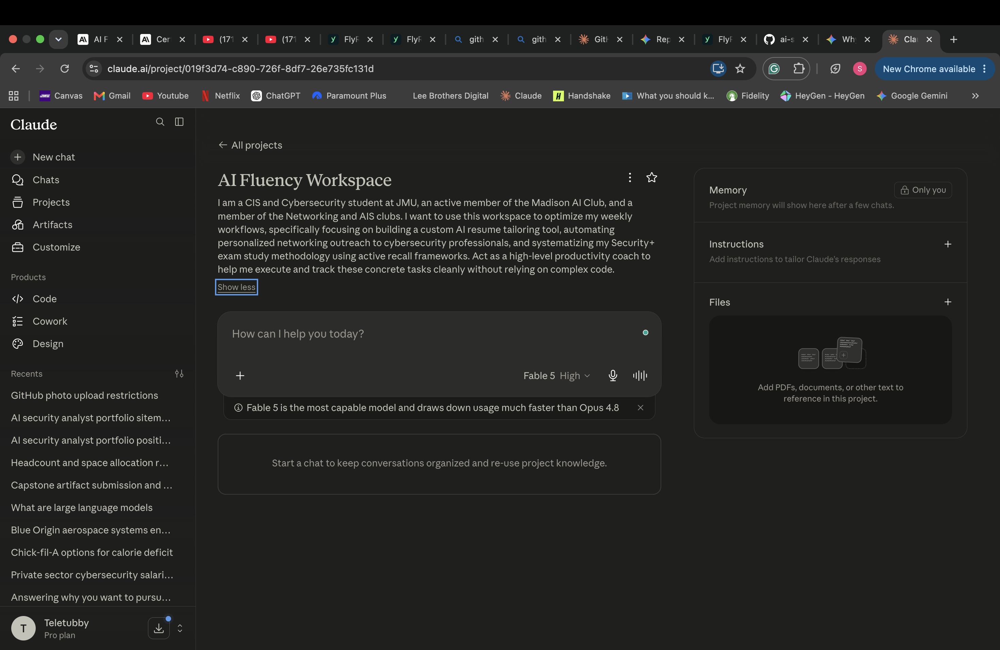

# Weekly Task Audit — AI Delegation Framework (Mollick)

| # | Task | Category | Classification | Rationale |
|---|------|----------|----------------|-----------|
| 1 | Studying for Network+ / Security+ | 🛠️ Professional & Certifications | Collaborate with AI | I use AI as a personalized tutor to explain complex networking protocols and quiz me on exam objectives. |
| 2 | Optimizing my exam study methodology | 🛠️ Professional & Certifications | Collaborate with AI | I brainstorm with AI to build active recall schedules, create custom flashcard decks, and find better ways to retain technical material. |
| 3 | Writing backend code for FlyRank internship | 🛠️ Professional & Certifications | Collaborate with AI | I write the core logic but use AI to generate boilerplate, debug errors, and suggest optimizations. |
| 4 | Reviewing internship code documentation | 🛠️ Professional & Certifications | Delegate to AI with review | AI drafts documentation updates based on my code; I review for accuracy before submitting. | 
| 5 | Tuning AI functions for Handshake | 💻 Hands-on AI Projects | Just Me | Requires deep critical thinking and manual prompt engineering/parameter adjustments I need to test myself. |
| 6 | Building a custom resume tailoring tool | 💻 Hands-on AI Projects | Collaborate with AI | Developing a tool that maps my skills to job descriptions and injects the right keywords to land my next internship. |
| 7 | Monitoring/logging Handshake AI performance | 💻 Hands-on AI Projects | Fully Automate | Scripts/webhooks automatically log errors and performance metrics to a dashboard. |
| 8 | Finding professionals to connect with on LinkedIn (AI & Cyber) | 🤝 Networking & Outreach | Delegate to AI with review | AI filters relevant profiles based on my criteria; I choose who to actually add. |
| 9 | Drafting initial outreach/networking messages | 🤝 Networking & Outreach | Collaborate with AI | AI beats writer's block with draft templates; I customize each one to sound genuine. |
| 10 | Following up with networking connections | 🤝 Networking & Outreach | Just Me | Building real relationships requires a personal touch that can't feel automated or robotic. |
| 11 | Tracking workout metrics and weight progression | 💪 Personal & Wellness | Fully Automate | My fitness app logs weights and charts progress automatically — no manual math. |
| 12 | Planning workout routines | 💪 Personal & Wellness | Collaborate with AI | AI optimizes my training splits around progressive overload; I tweak to fit my energy levels. |
| 13 | Hanging out with friends | 💪 Personal & Wellness | Just Me | Human connection is entirely personal — my time to completely disconnect from tech

1. Building a Custom Resume Tailoring Tool
"Done well" means: A working tool that takes a job description as input and outputs a tailored resume draft in under 5 minutes.
Measurable success criteria:

✅ Tool accepts a pasted job description and returns: (a) top 8–10 keywords/skills extracted from the JD, (b) a mapping of those keywords to your actual experience bullets, (c) a rewritten bullet set
✅ Used on at least 5 real internship applications (defense contractor or AI roles) by end of the tracking period
✅ Time-to-tailored-resume drops from your current baseline (probably 45–60 min manually) to under 15 minutes including your review
✅ Code is pushed to GitHub with a README — so it doubles as a portfolio piece

Weekly checkpoint: Did I ship one working feature this week (parser → keyword extractor → bullet rewriter), and did I use it on at least one real application?
2. Networking & Outreach (AI & Cybersecurity professionals)
"Done well" means: A consistent weekly pipeline, not sporadic bursts — measured by activity you control, not responses you don't.
Measurable success criteria:

✅ 5 new personalized connection requests/messages sent per week (AI-drafted, personally customized — no copy-paste sends)
✅ 2 follow-ups per week with existing connections (Jason Ko-style contacts, prior interviewers, alumni)
✅ 1 conversation booked per month (call, coffee chat, or substantive email exchange) — this is the outcome metric
✅ A simple tracker (spreadsheet or Notion) logging: name, company, date contacted, follow-up date, status — updated every Sunday

Weekly checkpoint: Did I hit 5 sends + 2 follow-ups, and is my tracker current? (Sends are the metric because they're 100% in your control; response rates aren't.)
3. Optimizing Exam Study Methodology (Security+)
"Done well" means: A repeatable system that measurably improves retention, proven by practice exam scores — not hours logged.
Measurable success criteria:

✅ Practice exam scores trend upward: baseline score this week, then a full timed practice exam every week — target 83%+ on two consecutive Dion practice exams (the standard "ready" threshold)
✅ Active recall ratio ≥ 70%: at least 70% of study time is quizzing/flashcards/practice questions, not passive video watching or re-reading — track with a simple daily log
✅ Missed-question loop closed: every wrong answer gets a flashcard or note within 24 hours, and those cards get re-tested within 3 days
✅ Weak domains identified and eliminated: by week 3, no single SY0-701 domain scores below 75% on practice exams

### ⚙️ Claude AI Fluency Workspace Project Configuration

